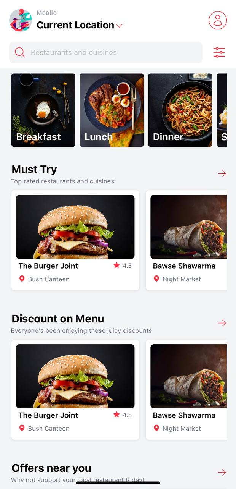

# Mealio
This is food delivery app for restaurants. It is built with React Native and TailwindCSS. It is currently in development and the repository and readme will be updated as the project progresses. 

## Getting Started
### Prerequisites
- Node.js
- Expo CLI
- Yarn
  
### Installation
1. Clone the repo
```sh
git clone https://github.com/neophyte-programmer/mealio.git
```

2. Install NPM packages
```sh
npm install
```
3. Start the app
```sh
npx expo start
```

## Preview 
